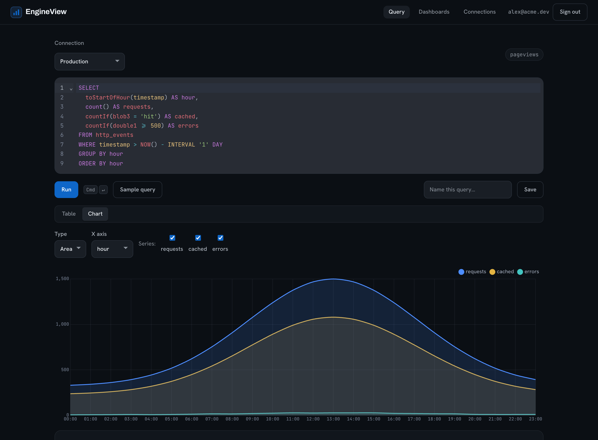
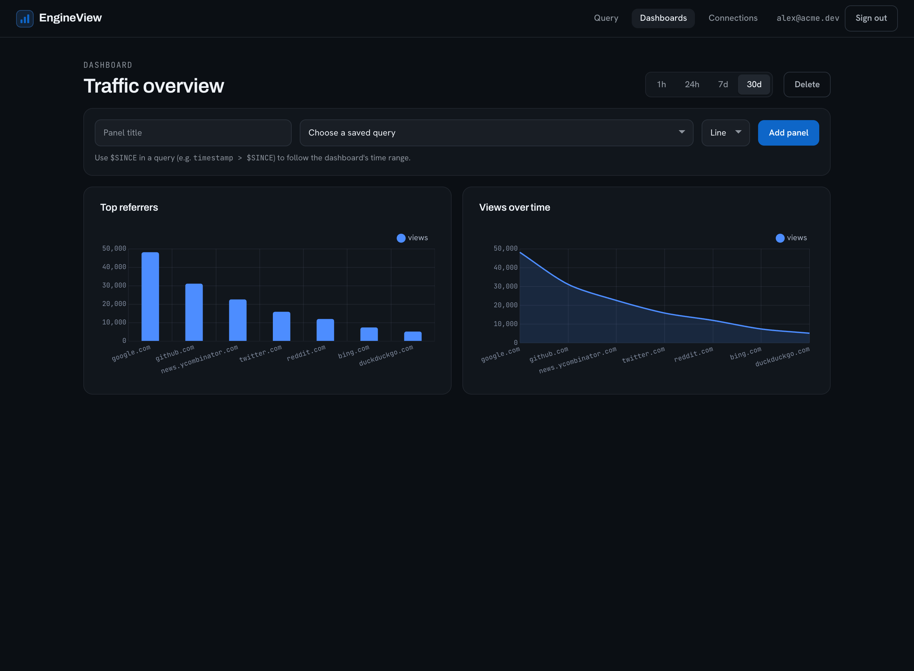

# EngineView

A multi-user dashboard for [Cloudflare Analytics Engine](https://developers.cloudflare.com/analytics/analytics-engine/).
Cloudflare gives you a powerful time-series store but no UI and no way to save
queries. EngineView lets people sign up, connect their own Cloudflare account,
run SQL against their datasets, save the queries they care about, and chart
them on multi-panel dashboards.

Each user brings their own Cloudflare account. API tokens are encrypted at rest
and only ever decrypted on the server to run a query, so a token is never sent
to the browser or shared between users.

## Screenshots

Write SQL against your datasets and switch between a table and a chart:



Arrange saved queries as stat tiles and charts on a dashboard with a shared time
range:



## Status

Working. Multi-user accounts, per-user Cloudflare connections, the SQL query
runner with charts, and multi-panel dashboards are all in place.

## Stack

- [Nuxt 4](https://nuxt.com) (Vue 3) for the app and server API
- [better-auth](https://better-auth.com) for email and password accounts
- [Postgres](https://www.postgresql.org) via [Drizzle ORM](https://orm.drizzle.team)
- [Resend](https://resend.com) for verification and password-reset email

## How it works

- Users sign up and log in (better-auth, signed session cookies). Email
  addresses are verified before first sign in, and passwords can be reset, with
  the emails sent through Resend.
- Each user adds one or more Cloudflare connections (account id + API token).
  The token is encrypted with AES-256-GCM before it is stored.
- A query is sent to the server, which decrypts the relevant token, calls the
  Analytics Engine SQL API, and returns the rows. The token never leaves the
  server.
- Saved queries and dashboards are stored in Postgres, scoped to each user.
- A result can be charted (line, area or bar) or shown as a single stat tile.
  Saved queries become dashboard panels, laid out in a grid with a shared time
  range. A query can use the
  `$SINCE` token (e.g. `timestamp > $SINCE`), which expands to the dashboard's
  selected range.

## Setup

Prerequisites: Node 20+, a Postgres database, and a Cloudflare account using
Analytics Engine.

```bash
npm install

# 1. Configure the environment
cp .env.example .env
#    Set DATABASE_URL, BETTER_AUTH_SECRET, BETTER_AUTH_URL and ENCRYPTION_KEY.
#    Generate secrets with: openssl rand -hex 32

# 2. Apply the database schema
npm run db:migrate

# 3. Run locally
npm run dev
```

A local Postgres is easy to start with Docker:

```bash
docker run -d --name engineview-pg -e POSTGRES_PASSWORD=postgres \
  -e POSTGRES_DB=engineview -p 5432:5432 postgres:16
```

On macOS, if `npm run dev` fails with a `vite-node` socket error (`EINVAL`),
your `$TMPDIR` path is too long for a unix socket. Run it with a short temp dir:
`TMPDIR=/tmp npm run dev`.

## Scripts

- `npm run dev` / `npm run build` / `npm run preview`
- `npm run db:migrate` (apply migrations), `npm run db:generate` (after a schema change)
- `npm run lint`, `npm run format`, `npm run typecheck`, `npm test`

## Deploy

Yes, it is a Cloudflare tool that does not run on Cloudflare, and that is on
purpose. EngineView reads your data through the Analytics Engine SQL API over
plain HTTPS, so the edge is never in the request path. That makes it a boringly
portable server app: run it on a small VPS, with Docker, or on a host like Fly
or Railway. You bring the Cloudflare account; the dashboard lives wherever you
want it.

### Docker Compose

The simplest way to run the whole stack (Postgres, migrations, app):

```bash
export BETTER_AUTH_SECRET=$(openssl rand -hex 32)
export ENCRYPTION_KEY=$(openssl rand -hex 32)
docker compose up --build
```

The app is served on `http://localhost:3000`. A `migrate` step runs before the
app starts, and `GET /api/health` reports database connectivity.

### Manual

```bash
npm ci
npm run build
npm run db:migrate          # against your production DATABASE_URL
node .output/server/index.mjs
```

Set `DATABASE_URL`, `BETTER_AUTH_SECRET`, `BETTER_AUTH_URL` and `ENCRYPTION_KEY`
in the environment. The server validates them on startup and exits with a clear
message if any are missing. Run it behind a reverse proxy that terminates TLS and
forwards the client IP (`x-forwarded-for` or `cf-connecting-ip`) so rate limiting
works.

## License

MIT. See [LICENSE](./LICENSE).
